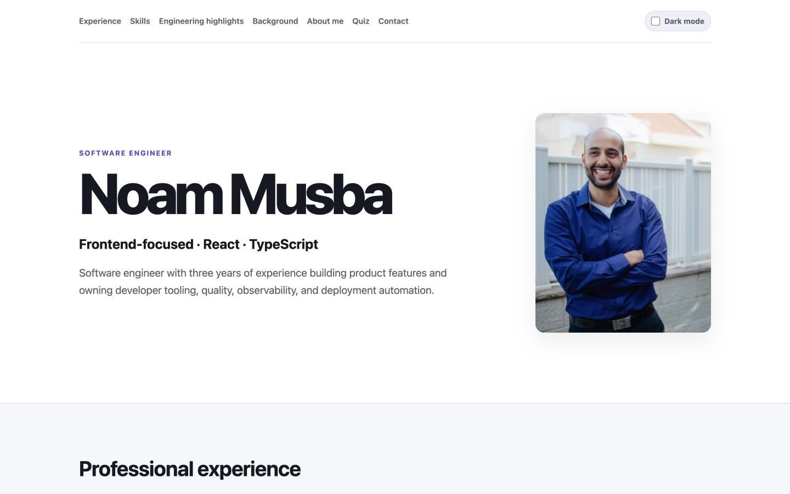
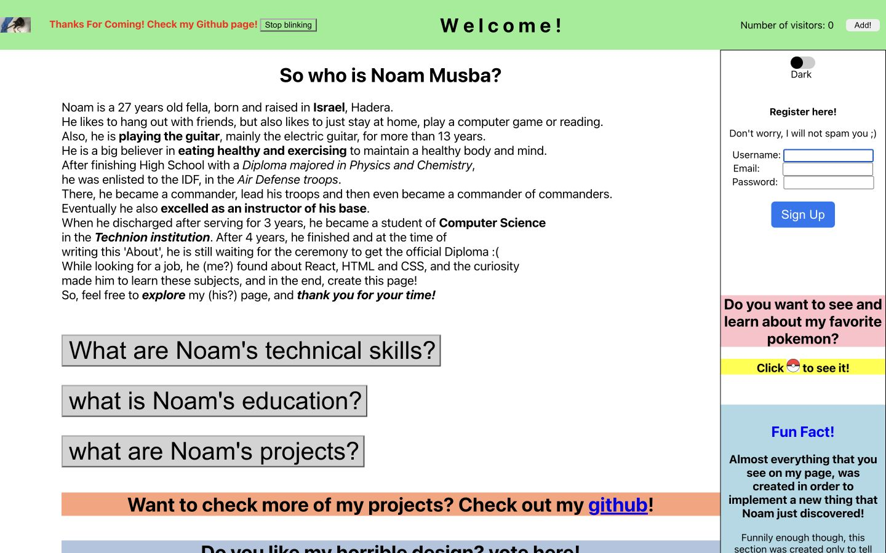

# Noam Musba — Portfolio

A frontend-focused software engineering portfolio built with React and TypeScript.

[View the refactored portfolio](https://noam-musba.github.io/Noams-Page/) · [See the original 2023 version](https://noam-musba.github.io/Noams-Page/legacy/)

## Project story

I originally built this site in 2023 while learning frontend development. Rather than replace that work with an unrelated new project, I refactored it incrementally to show how my approach changed after three years of professional software engineering experience.

The active portfolio is professional-first while retaining some personality through dark mode and the rebuilt quiz. The original site remains available as a frozen static archive, including its beginner-era design and learning-demo features.

## Before and after

| Refactored portfolio                                                                                                          | Original 2023 portfolio                                                                                 |
| ----------------------------------------------------------------------------------------------------------------------------- | ------------------------------------------------------------------------------------------------------- |
|  |  |

## Refactor highlights

- Migrated from Create React App to Vite and upgraded to React 19.
- Replaced JavaScript with strict TypeScript and typed content boundaries.
- Rebuilt the content hierarchy around professional experience, frontend skills, and engineering work.
- Introduced semantic landmarks, keyboard navigation, visible focus, accessible interaction states, and reduced-motion support.
- Reorganized styling with CSS Modules, semantic custom properties, responsive layouts, and persistent system-aware dark mode.
- Rebuilt the quiz with explicit state transitions and focused interaction tests.
- Added ESLint, Prettier, Vitest, Testing Library, and separate GitHub Actions quality, test, build, and deployment workflows.
- Preserved the original site independently under `/legacy/` without sharing active application code or dependencies.

## Architecture

The application deliberately remains small:

- `src/components/` contains the page sections and interactive UI.
- `src/data/` contains repeated typed portfolio and quiz data.
- `src/hooks/` contains the local theme behavior.
- `src/styles/` contains the few shared CSS Module layout boundaries.
- `public/` contains static metadata assets and the frozen, self-contained original build under `legacy/`.

There is no router, global state library, backend, application framework, or styling library because the current product does not require them. Unique narrative content stays close to its semantic markup instead of being routed through a generic content system.

## Run locally

The repository targets Node.js 24.

```bash
npm ci
npm run dev
```

The Vite development server prints the local URL after starting.

## Quality checks

```bash
npm run lint
npm run format:check
npm run typecheck
npm test
npm run build
```

Tests focus on meaningful behavior: page structure and navigation integrity, theme preference and persistence, and quiz state transitions and feedback.

## Deployment

GitHub Pages remains the host. Vite builds the application with the `/Noams-Page/` base path, and the generated `dist/` directory includes both the active application and the independent legacy snapshot.

Deployment is intentionally manual. The `Deploy to GitHub Pages` workflow must be dispatched from `main`; it runs the reusable quality and test workflows plus a production build before publishing the Pages artifact.

## Documentation

- [Refactor plan](docs/REFACTOR_PLAN.md)
- [Engineering decisions](docs/ENGINEERING_DECISIONS.md)
- [Legacy archive details](docs/LEGACY.md)
